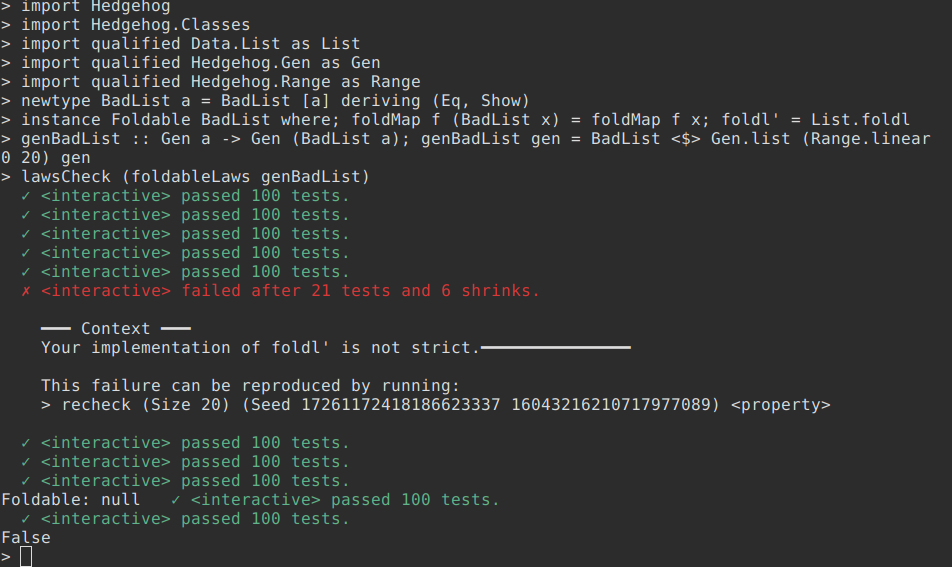
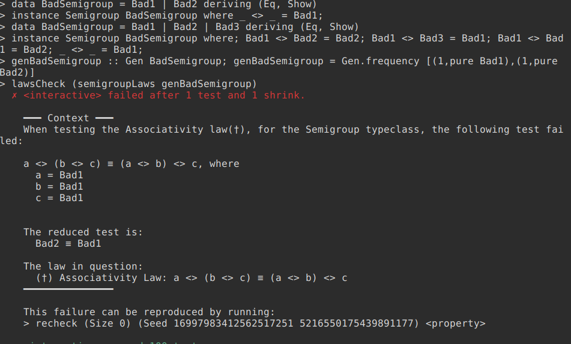

hedgehog-classes [![Hackage][hackage-shield]][hackage]
================

> Hedgehog will eat your typeclass bugs.


## Motivation

`hedgehog-classes` is a wrapper around [Hedgehog](http://hedgehog.qa/) that aims to provide a simple, straightforward API for testing common typeclass laws <i>quickly</i>, while providing good error messages to help debug any failing tests. It is inspired by the [quickcheck-classes](http://hackage.haskell.org/package/quickcheck-classes) library.

## API Overview

The API of `hedgehog-classes` is dead simple. There are three parts.

The first part is a datatype, called 'Laws', which looks like this:

```haskell
data Laws = Laws
  { lawsTypeclass :: String
  , lawsProperties :: [(String,Property)]
  }
```

It is a typeclass name along with a list of named property tests.

The second part of `hedgehog-classes` are the functions, which follow a simple structure. All functions in `hedgehog-classes` have one of the following three type signatures, based on the kind of the type which the corresponding typeclass parameterises (Nullary, Unary, or Binary). Note that they all return a 'Laws', only the inputs are different. Below, 'Ctx' refers to the typeclass in question:

```haskell
-- Typeclasses that have kind 'Type -> Constraint', e.g. 'Eq'
tcLaw :: (Ctx a, Eq a, Show a) => Gen a -> Laws

-- Typeclasses that have kind '(Type -> Type) -> Constraint', e.g. 'Functor'
tcLaw1 ::
  ( Ctx f
  , forall x. Eq x => Eq (f x)
  , forall x. Show x => Show (f x)
  ) => (forall x. Gen x -> Gen (f x)) -> Laws

-- Typeclasses that have kind '(Type -> Type -> Type) -> Constraint', e.g. 'Bifunctor'
tcLaw2 ::
  ( Ctx f
  , forall x y. (Eq x, Eq y) => Eq (f x y)
  , forall x y. (Show x, Show y) => Show (f x y)
  ) => (forall x y. Gen x -> Gen y -> Gen (f x y)) -> Laws
```

The third and last part of `hedgehog-classes` are the three convenience functions used to run your tests. They all return an `IO Bool`, where `True` is returned if all the tests pass, and `False` otherwise. They are as following:

```haskell
-- Test a single typeclasses' laws.
lawsCheck :: Laws -> IO Bool

-- Test multiple typeclass laws for a single type.
lawsCheckOne :: Gen a -> [Gen a -> Laws] -> IO Bool

-- Test mutliple typeclass laws for multiple types.
-- The argument is pairs of type names and their associated laws to test.
lawsCheckMany :: [(String, [Laws])] -> IO Bool
```

That is all there is to using `hedgehog-classes` in your test suite. For usage examples, see the [haddocks](http://hackage.haskell.org/package/hedgehog-classes).

## Distributing your own `Laws`

`hedgehog-classes` also exports some functions which you may find useful for writing functions that allow users to test the laws of typeclasses you define in your own libraries, along with utilities for providing custom error messages. They can be found [here](http://hackage.haskell.org/package/hedgehog-classes-0.1.0.0/docs/Hedgehog.-Classes.html#g:6).

## Example error messages
Below is an example of an error message one might get from a failed test from `hedgehog-classes`:





## Differences from similar libraries
There are a number of libraries that have similar goals to `hedgehog-classes`, and I will discuss only those that wrap `hedgehog`, not `QuickCheck`.

  - [hedgehog-checkers](https://github.com/bitemyapp/hedgehog-checkers):
      - Incomplete
      - Not actively developed
      - Less typeclasses
      - Hasn't been uploaded to hackage, even with a sufficient starting-point API
      - API is slightly more complex
      - Does not make an effort to provide custom error messages
      - Currently the only thing `hedgehog-checkers` can do that this library cannot
        is test properties of higher-kinded typeclass laws where the construction of
        the type requires constraints on its type arguments (e.g. `Ord` for something
        like `Data.Set.Set`)

  - [hedgehog-laws](https://github.com/qfpl/hedgehog-laws):
      - All of the things that apply to `hedgehog-checkers`, but even more incomplete.

## Supported Typeclasses

  - `base`
       - Alternative
       - Applicative
       - Arrow
       - Bifoldable
       - Bifunctor
       - Bitraversable
       - Bits/FiniteBits
       - Category
       - Contravariant
       - Enum
       - Eq
       - Foldable
       - Functor
       - Generic
       - Integral
       - Monad
       - MonadIO
       - MonadPlus
       - MonadZip
       - Ord
       - Semigroup
       - Show
       - ShowRead
       - Storable
       - Traversable
  - `aeson`
       - ToJSON
       - ToJSON/FromJSON
  - `semirings`
       - Semiring
       - Ring
  - `primitive`
       - Prim

Some typeclasses can have additional laws, which are not part of their sufficient definition. A common example is commutativity of a monoid. In such cases where this is sensible, `hedgehog-classes` provides functions such `commutativeMonoidLaws`, `commutativeSemigroupLaws`, etc. `hedgehog-classes` also tests that `foldl'`/`foldr'` actually accumulate strictly. There are other such cases that are documented on Hackage.

Support will be added for the typeclasses from [semigroupoids](http://hackage.haskell.org/package/semigroupoids).

Support will be added for the `Semiring`/`Ring` typeclasses from [semirings](http://hackage.haskell.org/package/semirings).

## Building

Currently, you need GHC >= 8.5 to build this (because of `-XQuantifiedConstraints`). Some CPP can be used to make this buildable with older GHCs, I just have not done so yet. I would gladly take a PR that does so, but only for GHC 8.2.2 and newer.

To use this library for testing, just add it to a test stanza of your cabal file.

To use this library to export your own `Laws` functions which you wish to distribute, add it to the library stanza of your cabal file.

  [hackage]: http://hackage.haskell.org/package/hedgehog-classes
  [hackage-shield]: https://img.shields.io/badge/hackage-v0.1.1.0-blue.svg

## Improvements

There are a number of improvements that can be made to the API of `hedgehog-classes`:

  - Traversable needs better error messages, without exposing library internals.
  - Arrow Laws 5/6/7 need names.
  - Some laws could use better names, as some of them I had to make up.
  - ixLaws can accidentally be extremely inefficient and I'm not sure how to fix that.
  - The test suite is incomplete.
  - There is no 'bad' test suite, for testing error messages.
  - There could be spelling mistakes/grammatical errors/inconsistencies in the custom error messages.

You can help fix any of the above by opening an issue/PR! Thanks.
